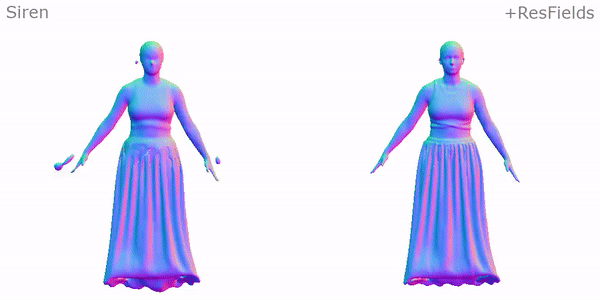

<p align="center">
  <p align="center">
    <h1 align="center">ResFields: Residual Neural Fields for Spatiotemporal Signals</h1>
  </p>
  <p align="center" style="font-size:16px">
    <a target="_blank" href="https://markomih.github.io/"><strong>Marko Mihajlovic</strong></a>
    ·
    <a target="_blank" href="https://vlg.inf.ethz.ch/team/Dr-Sergey-Prokudin.html"><strong>Sergey Prokudin</strong></a>
    ·
    <a target="_blank" href="https://scholar.google.com/citations?user=YYH0BjEAAAAJ&hl=en"><strong>Marc Pollefeys</strong></a>
    ·
    <a target="_blank" href="https://vlg.inf.ethz.ch/team/Prof-Dr-Siyu-Tang.html"><strong>Siyu Tang</strong></a>
  </p>
  <h2 align="center">ICLR 2024 (spotlight ✨)</h2>
  <div align="center"></div> 

  <p align="center">
    <a href="https://pytorch.org/get-started/locally/"></a>
    <a href="https://pytorchlightning.ai/"></a>
    <br>
    <a href='https://arxiv.org/abs/2309.03160'>
      
    </a>
    <a href='https://markomih.github.io/ResFields/' style='padding-left: 0.5rem;'>
      
    </a>
  </p>
<p align="center">
<a href='https://colab.research.google.com/drive/1kOf8RCXSGYQHyqJav_XJK73Rfdo74deY?usp=sharing'></a>

<!-- <video width="100%" autoplay muted controls loop src="https://github.com/markomih/ResFields/assets/13746017/4a0a39eb-77ae-4b7e-b5f9-a9b5544cc806"></video> -->
<p>
ResField layers incorporate time-dependent weights into MLPs to effectively represent complex temporal signals. 
</p>

## Applications


|                                                            |                                                                                                   |
| :--------------------------------------------------------------------------------: | :-----------------------------------------------------------------------------------------------------------------------: |
|                               2D Video Approximation                               |                                                   Temporal SDF Capture                                                    |
|                                                          |                                                                                       |
|                              Dynamic NeRFs from 4 RGB views                        |                                                   Dynamic NeRFs from 3 RGB-D                                              |


## News :triangular_flag_on_post:
- [2023/10/01] Code released. 

## Key idea of ResFields
Our key idea is to substitute one or several MLP layers with time-dependent layers whose weights are modeled as trainable residual parameters added to the existing layer weights.


We propose to implement the residual parameters as a global low-rank spanning set and a set of time-dependent coefficients. this modeling enhances the generalization properties and further reduces the memory footprint caused by maintaining additional network parameters. 


These residual weights are modeled as a learnable low-rank composition.

Increasing the model capacity in this way offers three key advantages:

1) **Runtime**: the underlying MLP does not increase in size and hence maintains the inference and training speed.
2) **Generalizability**: retains the implicit regularization and generalization properties of MLPs.
3) **Universality**: ResFields are versatile, easily extendable, and compatible with most MLP-based methods for spatiotemporal signals.


<details><summary>Please consider citing our work if you find it useful</summary>

```bibtex
@inproceedings{mihajlovic2024ResFields,
  title={{ResFields}: Residual Neural Fields for Spatiotemporal Signals},
  author={Mihajlovic, Marko and Prokudin, Sergey and Pollefeys, Marc and Tang, Siyu},
  booktitle={International Conference on Learning Representations (ICLR)},
  year={2024}
}
```
</details>
<br>

## Instructions
- See [installation](docs/installation.md) to install all the required packages
- See [data preparation](docs/data.md) to set up the datasets
- See [benchmark](docs/benchmark.md) on how to run various experiments and reproduce results from the paper

## Remaining tasks:
- Release RGB-D data
- Release data preprocessing code

## Citation
```bibtex
@inproceedings{mihajlovic2024ResFields,
  title={{ResFields}: Residual Neural Fields for Spatiotemporal Signals},
  author={Mihajlovic, Marko and Prokudin, Sergey and Pollefeys, Marc and Tang, Siyu},
  booktitle={International Conference on Learning Representations (ICLR)},
  year={2024}
}
```

## Acknowledgments
We thank Hongrui Cai and Ruizhi Shao for providing additional details about the baseline methods and Anpei Chen, Shaofei Wang, and Songyou Peng for proofreading the manuscript and proving useful suggestions. 

Some great prior work we benefit from:
- [Siren](https://github.com/vsitzmann/siren) for the 2D video approximation task
- [NeuS](https://github.com/Totoro97/NeuS) for data preprocessing and following their data format
- [Owlii](https://mpeg-pcc.org/index.php/pcc-content-database/owlii-dynamic-human-textured-mesh-sequence-dataset/), [DeformingThings4D](https://github.com/rabbityl/DeformingThings4D), and [ReSynth](https://pop.is.tue.mpg.de/) for datasets
- [PyTorch3D](https://github.com/facebookresearch/pytorch3d) for visualizing meshes and some evaluation scripts
- [Instant NSR](https://github.com/bennyguo/instant-nsr-pl) for inspiring the code structure

This project has been supported by [the Innosuisse Flagship project PROFICIENCY](https://www.surgicalproficiency.ch/).

## License
The code and models are available for use without any restrictions. 
See the [LICENSE](LICENSE) file for details. 

## Contact
Please open a PR or contact [Marko Mihajlovic](https://markomih.github.io/) for any questions. 
We greatly appreciate everyone's feedback and insights. 
Please do not hesitate to get in touch. 
