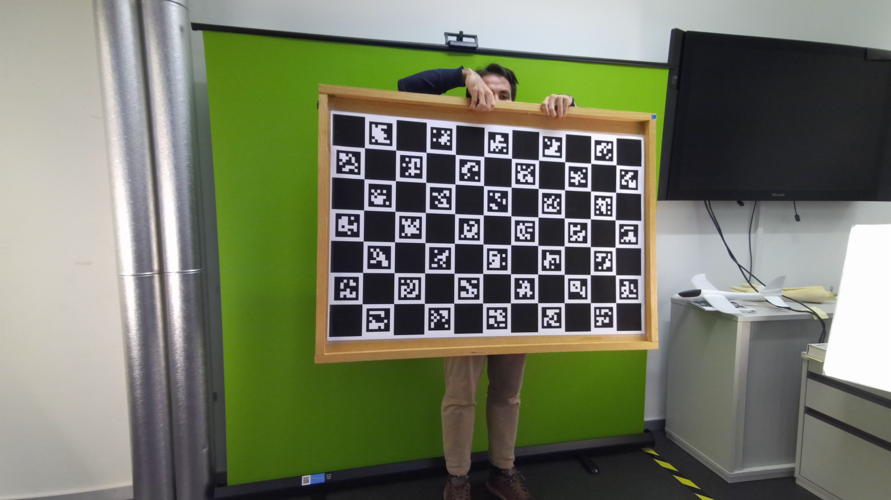
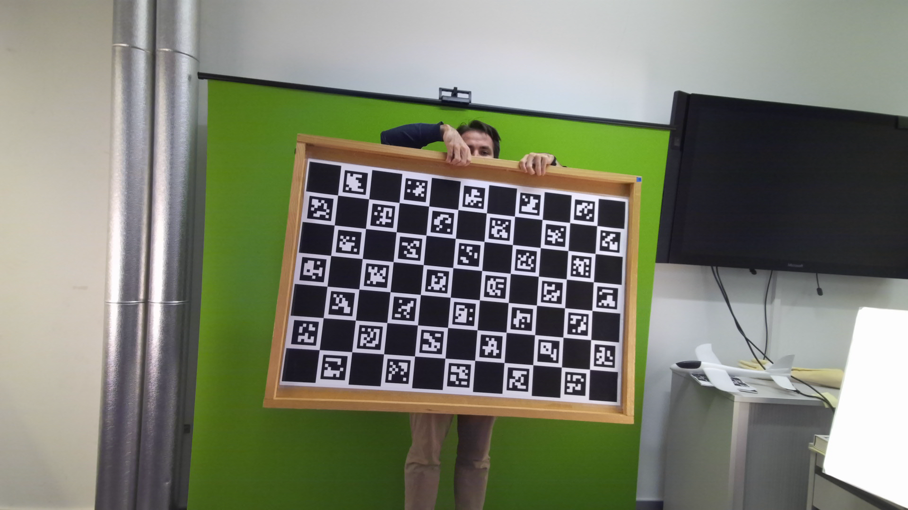
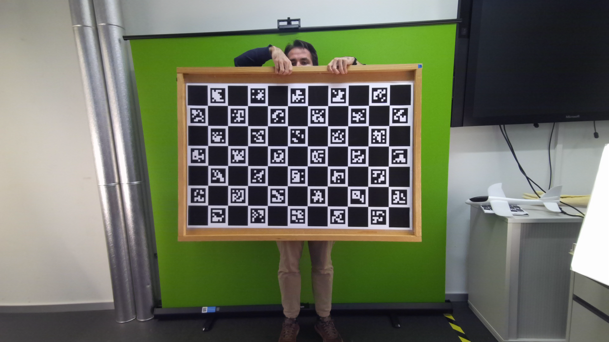
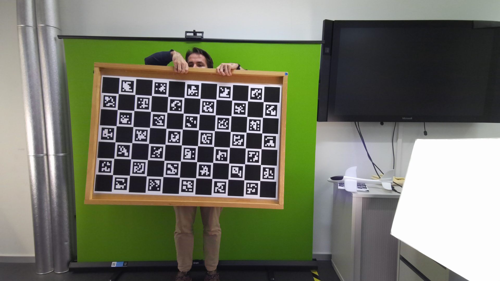
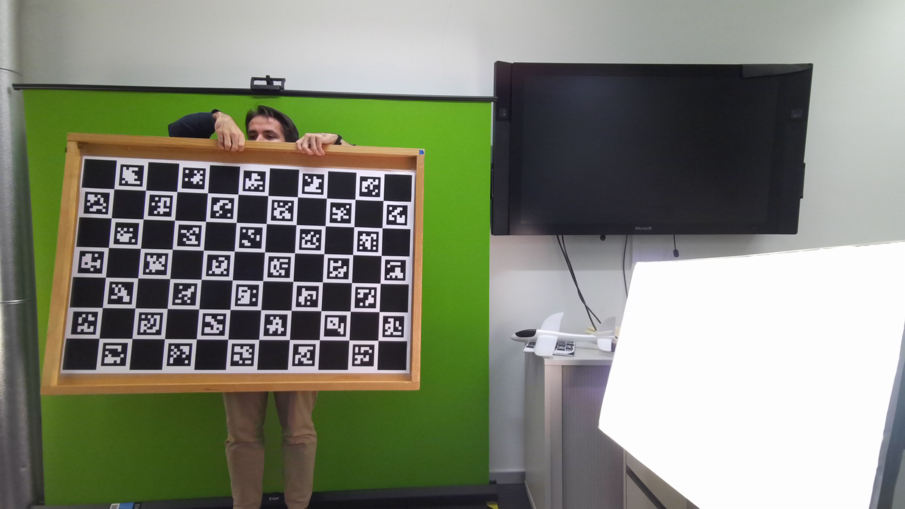
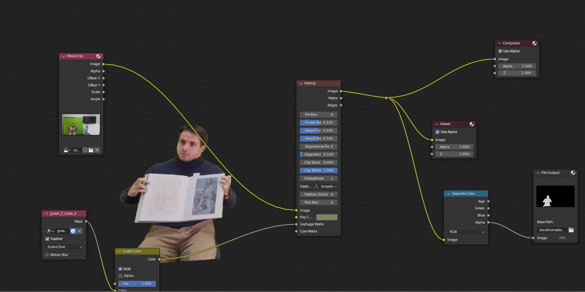

# DyCapLab - Automatic 4D Scene Dataset Creation - Script Guide

This script provides a way you can convert your videos to compatible dynamic NeuS/IDR setup (Owlii setup from docs/data.md). 
In scripts `preprocess_data_charuco.py` and `preprocess_data_colmap.py`, you can specify which videos in your setup are made with the moving/dynamic camera, and which are static. Following code below shows how to specify this in the script. 

Test dataset can be found in [shortened form in GDrive](https://drive.google.com/drive/folders/1rcwebURNmsDlcgDYkNymOWYpyD-7Vw4o?usp=sharing). `basketball` is one used for input, `basketball_colmap` is resulting format you should get after calling the `preprocess_data_colmap.py`, and `basketball_dataset_with_kinect_depths` is the resulting format you should get after calling the `preprocess_data_charuco.py` .


## Defining videos for preprocessing
Before calling script `preprocess_data_charuco.py`/`preprocess_data_colmap.py`, you should edit it and specify videos you are going to extract.

```python

    DATA_ROOT = "plane_dataset"

    static_video_paths = [
        f'{DATA_ROOT}/cam_0.mkv',
        f'{DATA_ROOT}/cam_1.mkv',
        f'{DATA_ROOT}/cam_2.mkv',
        f'{DATA_ROOT}/cam_3.mkv',
        f'{DATA_ROOT}/cam_4.mkv'

    ]    
    dynamic_video_paths = [
        # Empty, not yet supported
    ]
```

## <a name="initial_colmap"></a> Creating initial Pose Calibration dataset 
Before doing creation of your dataset, you should provide a feature-rich initial images for each camera view. We provide a ChArUco board in `charuco_gs5_with_kinect_depths` folder in [GDrive link](https://drive.google.com/drive/folders/1rcwebURNmsDlcgDYkNymOWYpyD-7Vw4o?usp=sharing) as an example.

You can create this initial calibration dataset with our calibration scripts `preprocess_data_charuco.py`/`preprocess_data_colmap.py` on the video 

<!-- make image grid 1x5 -->

<figure>





<figcaption>Calibration images for each camera view</figcaption>
</figure>


## Masking


Before preprocessing, you can do masking. Provide empty masks in case you want to skip masking. We provide Blender project in [project.blend](https://drive.google.com/drive/folders/1rcwebURNmsDlcgDYkNymOWYpyD-7Vw4o?usp=sharing) file, that you can use to do masking chroma key masking. We will provide SAM/XMem-supported segmentation in the future.

Masks are already provided for dummy example in basketball/masks folder this file structure:
    
    ```
    basketball
    ├── cam_0.mkv
    ├── cam_1.mkv
    ├── cam_2.mkv
    ├── cam_3.mkv
    ├── cam_4.mkv
    ├── masks
    │   ├── cam_0/*.png
    │   ├── cam_1/*.png
    │   ├── cam_2/*.png
    │   ├── cam_3/*.png
    │   └── cam_4/*.png
    ```

Keep the above structure when doing conversion to Owlii format. 
<!-- add image -->


### Colmap to Owlii format arguments :
   Script currently supports only the dynamic scene format with only non-moving/static cameras.

 #### preprocess_data_colmap.py
   * --colmap_db : path to colmap database (default: 'colmap.db').
   * --colmap_matcher : which matcher to use (default: 'exhaustive')
   * --input_model_path : COLMAP model's name (default: 'colmap_model')
   * --run_make_dataset: calls video-to-images script for each video in dataset.            
      - --extracted_images_folder : path to folder where images from videos are extracted, and will be later used for COLMAP. Each video will have a separate folder with color and possibly depth images.
   * --run_initial_colmap: calls colmap on calibration images dataset from [initially created calibration dataset](#initial_colmap) .
   * -- run_transform_neus: call conversion of all extracted images and depths and camera intrinsics to format compatible with NeuS/IDR format (Owlii dataset from DATA_ROOT). You'll be prompted to choose whether you want to edit pointcloud with COLMAP SfM features as shown in [NeuS repo](https://github.com/Totoro97/NeuS/tree/main/preprocess_custom_data). You may skip this step if convenient.

##### Example run:
    
```bash
python preprocess_rgb_data.py --colmap_db basketball_colmap.db --colmap_matcher exhaustive --input_model_path basketball_model --run_make_dataset --extracted_images_folder basketball_colmap --run_initial_colmap --run_transform_neus
```

#### preprocess_data_charuco.py
* --align_depth : aligns depths to color images (default: False)     
* --downscale_factor : downscale factor for images (default: 1)
* --ignore_depths : ignores depth images (default: False)
* --run_make_dataset : calls video-to-images script for each video in dataset.            
    - --src_dir : path to folder with images and depths to save to.
* --run_calibration_finding : calls calibration finding script for each video in dataset.            
* --run_transform_charuco_calibration2neus : calls conversion of all extracted images and depths and camera intrinsics to format compatible with NeuS/IDR format.


### Example run:

```bash
python preprocess_rgb_data.py --align_depth 0 --downscale_factor 1 --src_dir basketball_dataset_with_kinect_depths --ignore_depth 0 --run_make_dataset --run_calibration_finding --run_transform_charuco_calibration2neus
```

## TODO list:
- [ ] Add aligned depth support for training.
- [ ] Add SAM/XMem segmentation support.
- [ ] Add downscale factor support.
- [ ] Add SLAM/COLMAP support for moving camera capture.
- [ ] Make abstract support for video loading (Kinect's MKV, GoPro, Realsense etc.).

